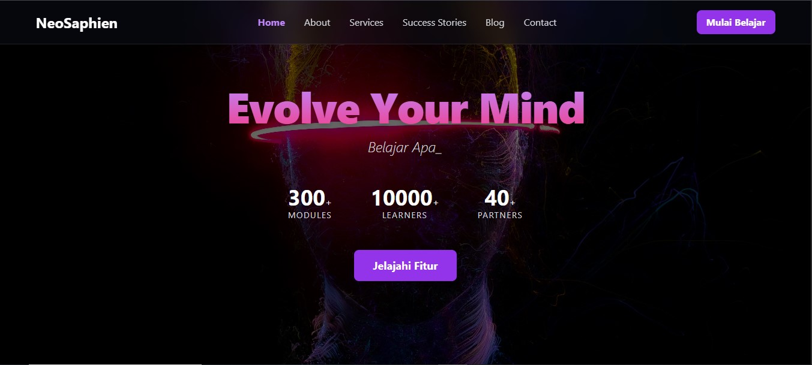
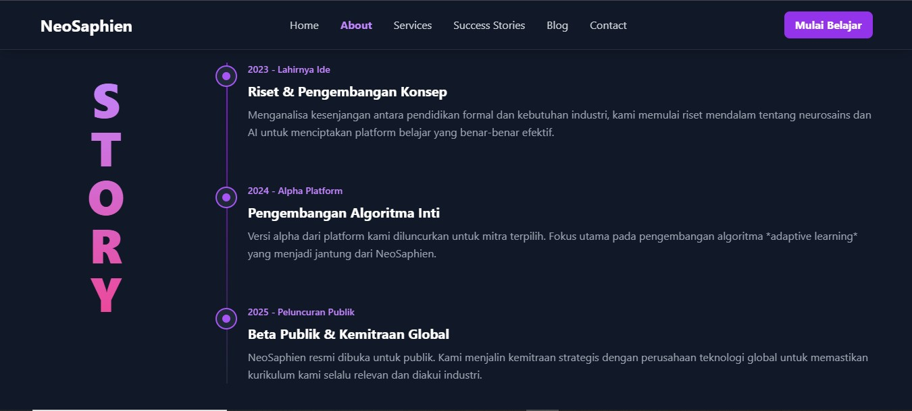

# Proyek Ujian Akhir PPPL - NeoSaphien

* **Nama:** [Maglon Martino]
* **NPM:** [233405002]
* **Mata Kuliah:** Prinsip Pengembangan Perangkat Lunak (IF24205)

---

## Deskripsi Proyek

**NeoSaphien** adalah sebuah website *multi-page* yang dirancang sebagai prototipe untuk platform EduTech (Teknologi Pendidikan) fiktif. Proyek ini dibangun untuk memenuhi semua persyaratan Ujian Akhir Semester mata kuliah Prinsip Pengembangan Perangkat Lunak. Website ini dibuat sepenuhnya menggunakan teknologi front-end dasar: **HTML5, CSS3 (dengan Tailwind CSS via CDN), dan JavaScript (ES6+) murni** tanpa *framework*.

Tujuannya adalah untuk menciptakan sebuah website yang tidak hanya fungsional, tetapi juga memiliki User Interface (UI) yang modern (dengan tema *Glassmorphism*), User Experience (UX) yang kaya akan interaktivitas, dan kode yang terstruktur dengan baik.

## Screenshots

| Halaman Utama | Halaman Portfolio |
| :---: | :---: |
|  |  |

*(**Instruksi:** Ambil screenshot dari halaman Anda, simpan dengan nama `screenshot-homepage.png` dan `screenshot-portfolio.png` di dalam folder `assets/images/`, lalu unggah ke GitHub.)*

---
## ✨ Fitur Utama & Interaktivitas

Berikut adalah rincian detail dari setiap fitur dan elemen interaktif yang telah diimplementasikan sesuai dengan ketentuan ujian, beserta improvisasi yang dilakukan.

### **Fitur Global**
* **Navbar Aktif Dinamis:** Link pada navbar akan otomatis menyorot (berubah warna menjadi ungu dan tebal) sesuai dengan halaman yang sedang aktif, dikontrol oleh JavaScript.

### 🏠 **Halaman Utama (`index.html`)**
* **Hero Section Interaktif:**
    * [✅] **Efek Parallax Scrolling:** Latar belakang bergerak lebih lambat saat scroll untuk menciptakan ilusi kedalaman.
    * [✅] **Efek Ketik Dinamis:** Tagline muncul dengan animasi mengetik yang dibuat dari nol menggunakan JavaScript murni.
    * [✅] **Penghitung Statistik Interaktif:** Angka statistik akan beranimasi menghitung naik saat section masuk ke layar, dikontrol oleh **Intersection Observer API**.
* **Features Section:**
    * [✅] **Efek Hover Kartu:** Kartu "mengangkat" dan memiliki efek cahaya *glow* ungu saat di-hover.
    * [✅] **Ikon Animasi:** Ikon di dalam kartu ikut membesar saat kartu di-hover.
    * [✅] **Progressive Disclosure:** Tombol "Selengkapnya" menampilkan/menyembunyikan detail tambahan saat diklik.
* **Testimonials Section:**
    * [✅] **Carousel Dinamis:** Konten testimoni di-generate seluruhnya dari array data di JavaScript.
    * [✅] **Auto-Sliding Carousel:** Carousel bergeser otomatis dan dapat dinavigasi secara manual.
    * [✅] **Layout Responsif 2-Kartu:** Menampilkan 2 testimoni per slide di desktop, dan 1 di mobile, dengan tinggi kartu yang disamakan.

### 🏢 **Halaman About (`about.html`)**
* **Company Story & Timeline:**
    * [✅] **Animasi Scroll Bertingkat (Staggered):** Item timeline muncul satu per satu dengan jeda waktu saat di-scroll, menggunakan **Intersection Observer API** dan `setTimeout`.
    * [✅] **Judul Vertikal Responsif:** Judul "STORY" ditampilkan secara vertikal (huruf bertumpuk) di desktop dan otomatis menjadi horizontal di mobile.
* **Team Section:**
    * [✅] **Kartu Tim dengan Efek Flip:** Setiap kartu anggota tim akan membalik secara 3D saat di-hover untuk menampilkan detail bio, menggunakan CSS 3D Transforms.

### 🚀 **Halaman Services (`services.html`)**
* **Sistem Tab Interaktif:**
    * [✅] Halaman diorganisir menggunakan sistem tab fungsional yang dikontrol oleh JavaScript.
* **Katalog & Filter:**
    * [✅] **Filter Dinamis:** Katalog kursus dapat difilter berdasarkan kategori secara *real-time*.
* **Kalkulator & Form:**
    * [✅] **Kalkulator Harga Interaktif:** Total harga ter-update secara otomatis saat pengguna memilih paket atau fitur tambahan.
* **Tabel Perbandingan:**
    * [✅] Desain perbandingan diubah dari tabel menjadi 3 kartu harga modern yang responsif dan memiliki efek hover.

### 🌍 **Halaman Portfolio (`portfolio.html`)**
* **Project Showcase:**
    * [✅] **Peta Interaktif:** Menampilkan peta Indonesia kustom dengan penanda lokasi yang berdenyut (CSS Animation).
    * [✅] **Filter Dinamis pada Peta:** Penanda di peta dapat disaring berdasarkan kategori.
    * [✅] **Modal Detail Dinamis:** Mengklik penanda atau kartu akan membuka modal (pop-up) yang kontennya diisi secara dinamis.
    * [✅] **Galeri Lightbox:** Galeri gambar di dalam modal dapat diklik untuk menampilkan gambar dalam *lightbox* layar penuh.

### 📞 **Halaman Contact (`contact.html`)**
* **Sistem Kontak Canggih:**
    * [✅] **Formulir Validasi Real-time:** Pesan error muncul dan hilang secara instan saat pengguna mengetik.
    * [✅] **Integrasi Google Maps:** Peta lokasi ditanamkan menggunakan `<iframe>`.
    * [✅] **FAQ Accordion dengan Pencarian:** Pengguna dapat membuka/tutup jawaban serta mencari FAQ secara *real-time*.
    * [✅] **Simulasi Live Chat:** Widget chat fungsional dengan simulasi balasan otomatis.

### 📝 **Halaman Blog (Opsional)**
* [✅] **Konten Dinamis & Paginasi:** Daftar artikel dibagi menjadi beberapa halaman yang dapat dinavigasi.
* [✅] **Filter Kategori & Pencarian:** Sidebar memungkinkan pengguna memfilter dan mencari artikel.
* [✅] **Kalkulator Waktu Baca:** Estimasi waktu baca dihitung dan ditampilkan di setiap kartu.
* [✅] **Simulasi Tombol Share:** Tombol share fungsional yang mengarah ke URL share media sosial.

---

## Teknologi yang Digunakan

* **HTML5**
* **CSS3** (Animations, 3D Transforms, Custom Properties)
* **Tailwind CSS (v3 via CDN)**
* **JavaScript (ES6+)** (DOM Manipulation, Events, Intersection Observer, Array Methods)

---

## Struktur Proyek

```
/
│
├── index.html
├── about.html
├── services.html
├── portfolio.html
├── contact.html
├── blog.html
│
├── assets/
│   ├── css/
│   │   └── style.css
│   ├── js/
│   │   └── script.js
│   └── images/
│       ├── hero-bg.jpg
│       ├── world-map.png
│       └── (screenshots)
│
└── README.md
```

---

## Cara Menjalankan Proyek

1.  Clone repositori ini ke komputer lokal Anda (`git clone [URL_REPO_ANDA]`).
2.  Buka folder proyek.
3.  Buka file `index.html` menggunakan browser web modern (disarankan Google Chrome atau Firefox).
